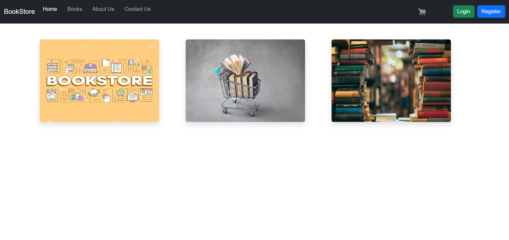
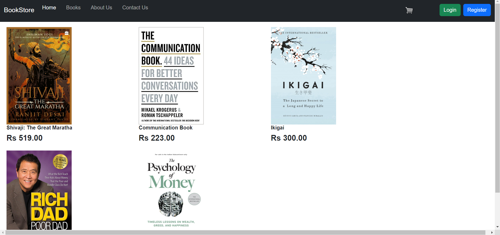
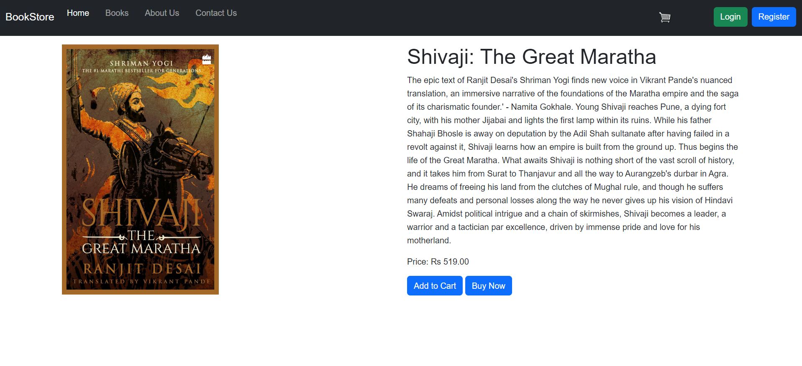

# Bookstore Django Application

This is a Django-based web application for managing a bookstore. It provides features for browsing books, adding books to a shopping cart, and processing orders. This project is built using Django, a popular Python web framework.

## Tech Stack

- **Backend:** Django, Django REST Framework
- **Frontend:** HTML, CSS, Bootstrap
- **Database:** SQLite (default)
- **Others:** Django Crispy Forms for form styling
- **Containerization:** Docker & Kubernetes resources (Deployment, Service, Ingress)
- **CI:** GitHub Actions
- **CD:** ArgoCD


### Steps

1. **Clone the repository:**

   ```bash
   git clone https://github.com/yourusername/bookstore-django.git
   cd bookstore-django

2. **Create a virtual environment and activate it:**

    ```bash
    python -m venv venv
    source venv/bin/activate  # On Windows use `venv\Scripts\activate`

3. **Install the required packages:**
    
    ```bash
    pip install -r requirements.txt


4. **Create a Django secret key:**
     Use GIT Bash on Windows OS or Run command in Linux Server.

    ```bash
    python -c 'from django.core.management.utils import get_random_secret_key; print(get_random_secret_key())'

5. **Create other environment variables:**
    1. RAZORPAY_KEY_ID
    2. RAZORPAY_SECRET_KEY
    3. EMAIL_BACKEND
    4. EMAIL_HOST
    5. EMAIL_PORT
    6. EMAIL_USE_TLS
    7. EMAIL_HOST_USER
    8. EMAIL_HOST_PASSWORD

5. **Run database migrations:**

    ```bash
    python manage.py migrate

6. **Run the application:**

    ```bash
    python manage.py runerver

7. **Open your browser and visit:**

    ```bash
    http://127.0.0.1:8000/


## Screenshots

### Homepage



### Booklist



### Bookdetails



    
